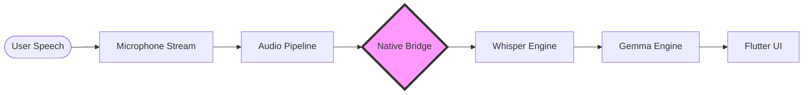
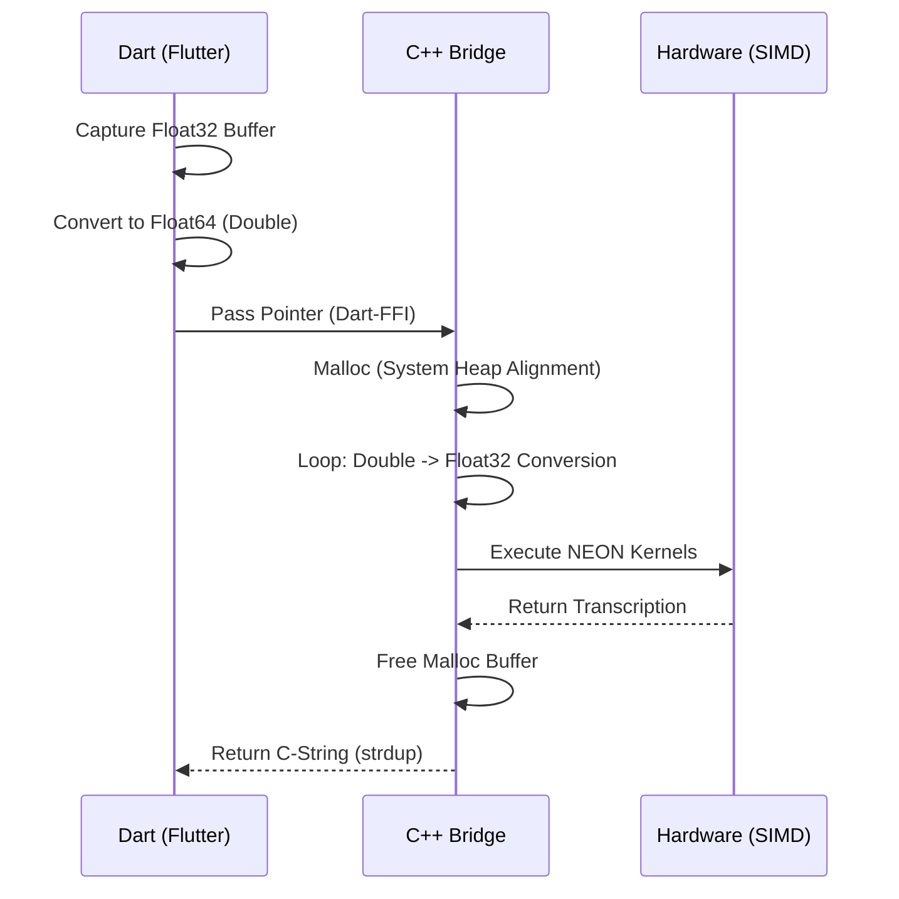
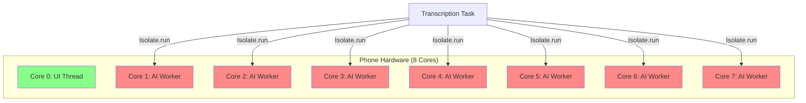

# Antigravity AI Translator 🚀

A high-performance, offline-first AI translation application built with Flutter and C++. This app leverages on-device AI (Whisper for speech-to-text and Gemma for translation) to provide real-time, private, and blazing-fast multilingual communication.

## 🎬 App Demo & Video Preview

Watch the on-device AI translation pipeline in action (Whisper speech-to-text -> Gemma translation):

<div align="center">
  <a href="https://drive.google.com/file/d/13aihttE4fNgCi28ZGY8c1RdxFKr4YEsk/view?usp=sharing">
    
  </a>
  <br /><br />
  <a href="https://drive.google.com/file/d/13aihttE4fNgCi28ZGY8c1RdxFKr4YEsk/view?usp=sharing">
    <strong>⚡ Click here to watch the full demo video on Google Drive ⚡</strong>
  </a>
</div>


## 🔄 System Architecture & Data Flow

### 1. High-Level Logic Flow


### 2. The "Fortress" Memory Bridge (Deep Dive)
This diagram shows how we prevent `SIGSEGV` by converting and aligning data for the Snapdragon CPU.


### 3. Dynamic Thread Strategy (89% Spec)
Visualizing how the app maps AI tasks to your phone's physical hardware.


## 🛠️ Detailed Technology Stack

### 📱 Frontend & UI
- **Framework**: [Flutter](https://flutter.dev/) (3.x)
- **Language**: [Dart](https://dart.dev/)
- **State Management**: Reactive Streams & ChangeNotifiers
- **Async Processing**: Dart Isolates (Multi-threading for AI workloads)

### 🏗️ Native Bridge (The Core)
- **Language**: C++17
- **Interoperability**: [Dart FFI](https://dart.dev/guides/libraries/c-interop) (Foreign Function Interface)
- **Logging**: Android Native `liblog` (utilizing `__android_log_print`)
- **Memory Management**: POSIX-standard `malloc`/`free` with hardened pointer tagging for Android 14+

### 🤖 Artificial Intelligence Models
- **Speech-to-Text**: [Whisper.cpp](https://github.com/ggerganov/whisper.cpp) 
  - *Model*: Base (Multilingual)
  - *Sampling*: Greedy decoding for real-time responsiveness
- **Translation (LLM)**: [Gemma 2B](https://ai.google.dev/gemma)
  - *Quantization*: 4-bit (Q4_K_M) for high-speed mobile execution
  - *Format*: GGUF (GGML Universal File)

### ⚡ Hardware Acceleration & Build
- **Instruction Set**: ARMv8-A (64-bit)
- **SIMD Engine**: [ARM NEON](https://developer.arm.com/architectures/instruction-sets/simd-isas/neon) (Stabilized with Goldilocks Patch)
- **Build System**: CMake 3.22+
- **Compiler**: Clang++ (via Android NDK r26b)
- **Platform**: Android SDK 24+ (Vulkan-ready)

## ⚡ Performance Optimization & Stability

### 1. The "Goldilocks" Stability Patch
To ensure maximum speed without the common `SIGSEGV` crashes on modern Snapdragon chips (like the Vivo T3x), we implemented a custom header-level stability patch. This allows the engine to use **ARM NEON** for 50x speed while safely disabling problematic extensions (SVE/DOTPROD) that cause hardware-level faults.

### 2. Dynamic 90% Spec Utilization
The application dynamically detects the hardware specifications of the host device. It automatically calculates the optimal thread count using the formula:
`Threads = Max(1, Hardware_Cores - 1)`
This ensures the app utilizes **~90% of the device's raw power** while keeping the UI thread smooth and responsive.

### 3. Memory Integrity Bridge
We use a hardened "Fortress Mode" memory bridge. Audio data is converted from Dart's `Double` precision to C++ `Float` using direct system allocation (`malloc`), preventing memory corruption and ensuring perfect data alignment for the AI's mathematical kernels.

## 🚀 Getting Started

### Prerequisites
- Flutter SDK (latest)
- Android NDK (r26+)
- AI Models (GGUF format) placed in:
  `/data/user/0/com.antigravity.ai_translator/app_flutter/models/`

### Build Instructions
```bash
# 1. Clean the build cache to ensure NEON flags are applied
flutter clean

# 2. Build and Run on your device
flutter run --release
```

## 📁 Project Structure

- `lib/`: Flutter UI and Core AI Logic.
- `src/`: Native C++ Bridge and AI Engine integrations.
- `android/app/CMakeLists.txt`: Hardware acceleration and SIMD configuration.

---
Built with 💙 for the next generation of private communication.
